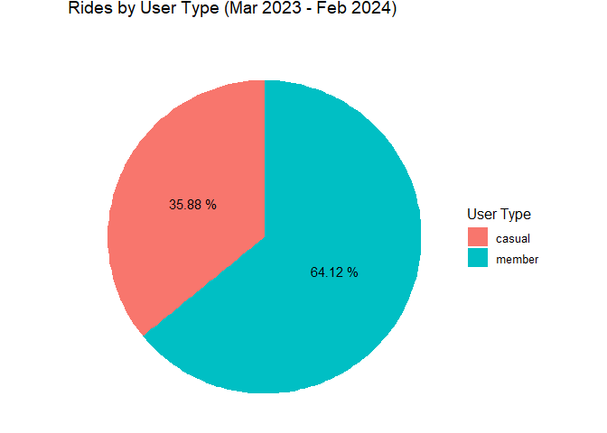
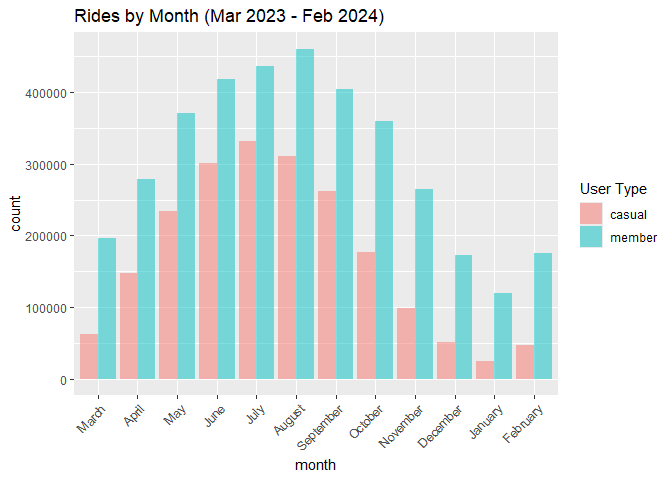
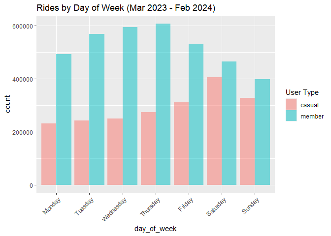
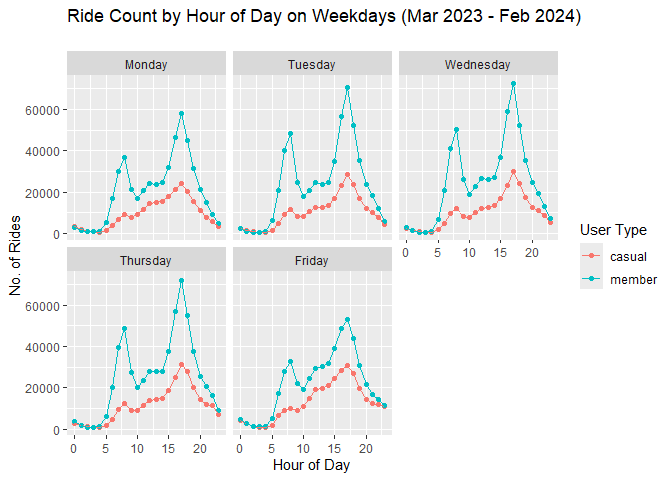
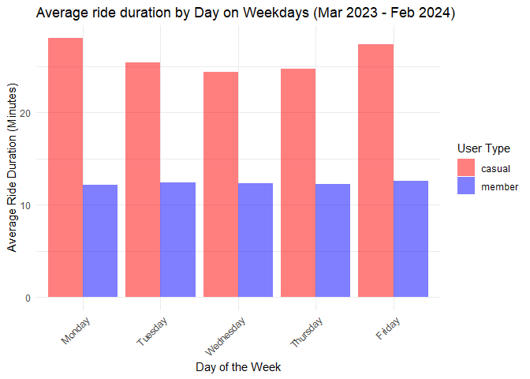
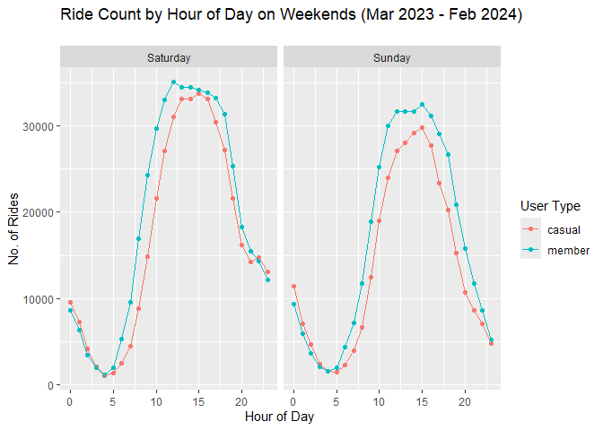
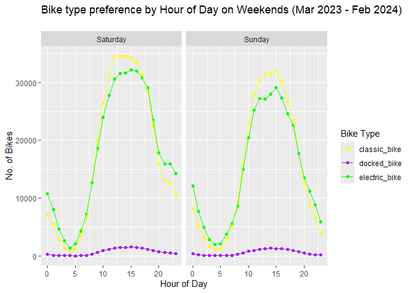
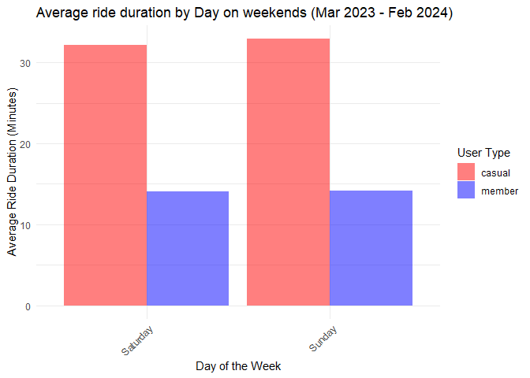

BikeShareAnalysis
================
Razeen
2024-03-14

# Background

Cyclistic is a prominent bike-share company based in Chicago. Since its
establishment in 2016, Cyclistic has expanded the services to 692
stations across Chicago with 5,824 bikes. The pricing options, including
single-ride and full-day passes, alongside coveted annual memberships,
offer flexibility to a diverse customer base.

Financial analysis has affirmed the profitability of annual memberships.
Therefore, this task revolves around enhancing annual memberships at
Cyclistic, to ensure its enduring success. Under the guidance of Lily
Moreno, marketing director, the aim is to explore bike usage between
casual riders and annual members.

The objective is to create an effective marketing strategy that
transitions casual riders into committed annual members, all underpinned
by compelling data insights and visualizations.

# Objective

The objective of the analysis is to answer the following question.

- How do annual members and casual riders use Cyclistic bikes
  differently?

# Prepare data for Analysis

Historic data required for the analysis were to be downloaded from
bike-share company dataset named Divvy.  
Following steps were taken to prepare the data for exploration.

1.  Download last 12 months of rides data from
    [Divvy.](https://divvy-tripdata.s3.amazonaws.com/index.html)  
2.  The compressed files for each month were extracted into the project
    folder.  
3.  The CSV files were then examined to understand the size of the data
    as well as available variables for analysis.  

CSV files consist of 13 columns and thousands of observations in each
file. When combined it would be over 5 million observations. Therefore,
using R would be ideal to load each csv to dataframes and then combine
all dataframes to a single dataframe.

# Process the data

## Load Packages

``` r
library(tidyverse)
```

    ## Warning: package 'tidyverse' was built under R version 4.3.3

    ## Warning: package 'ggplot2' was built under R version 4.3.3

    ## ── Attaching core tidyverse packages ──────────────────────── tidyverse 2.0.0 ──
    ## ✔ dplyr     1.1.4     ✔ readr     2.1.5
    ## ✔ forcats   1.0.0     ✔ stringr   1.5.1
    ## ✔ ggplot2   3.5.0     ✔ tibble    3.2.1
    ## ✔ lubridate 1.9.3     ✔ tidyr     1.3.1
    ## ✔ purrr     1.0.2     
    ## ── Conflicts ────────────────────────────────────────── tidyverse_conflicts() ──
    ## ✖ dplyr::filter() masks stats::filter()
    ## ✖ dplyr::lag()    masks stats::lag()
    ## ℹ Use the conflicted package (<http://conflicted.r-lib.org/>) to force all conflicts to become errors

``` r
library(readr)
library(lubridate)
library(ggplot2)
# turn off scientific notations for axis
options(scipen = 999, repr.plot.width = 11, repr.plot.height = 8)
```

Loading CSV files into dataframes for each month using *read_csv*
function.

``` r
Data202303 <- read_csv('csv_files/202303-divvy-tripdata.csv')
```

    ## Rows: 258678 Columns: 13
    ## ── Column specification ────────────────────────────────────────────────────────
    ## Delimiter: ","
    ## chr  (7): ride_id, rideable_type, start_station_name, start_station_id, end_...
    ## dbl  (4): start_lat, start_lng, end_lat, end_lng
    ## dttm (2): started_at, ended_at
    ## 
    ## ℹ Use `spec()` to retrieve the full column specification for this data.
    ## ℹ Specify the column types or set `show_col_types = FALSE` to quiet this message.

``` r
Data202304 <- read_csv('csv_files/202304-divvy-tripdata.csv')
```

    ## Rows: 426590 Columns: 13
    ## ── Column specification ────────────────────────────────────────────────────────
    ## Delimiter: ","
    ## chr  (7): ride_id, rideable_type, start_station_name, start_station_id, end_...
    ## dbl  (4): start_lat, start_lng, end_lat, end_lng
    ## dttm (2): started_at, ended_at
    ## 
    ## ℹ Use `spec()` to retrieve the full column specification for this data.
    ## ℹ Specify the column types or set `show_col_types = FALSE` to quiet this message.

``` r
Data202305 <- read_csv('csv_files/202305-divvy-tripdata.csv')
```

    ## Rows: 604827 Columns: 13
    ## ── Column specification ────────────────────────────────────────────────────────
    ## Delimiter: ","
    ## chr  (7): ride_id, rideable_type, start_station_name, start_station_id, end_...
    ## dbl  (4): start_lat, start_lng, end_lat, end_lng
    ## dttm (2): started_at, ended_at
    ## 
    ## ℹ Use `spec()` to retrieve the full column specification for this data.
    ## ℹ Specify the column types or set `show_col_types = FALSE` to quiet this message.

``` r
Data202306 <- read_csv('csv_files/202306-divvy-tripdata.csv')
```

    ## Rows: 719618 Columns: 13
    ## ── Column specification ────────────────────────────────────────────────────────
    ## Delimiter: ","
    ## chr  (7): ride_id, rideable_type, start_station_name, start_station_id, end_...
    ## dbl  (4): start_lat, start_lng, end_lat, end_lng
    ## dttm (2): started_at, ended_at
    ## 
    ## ℹ Use `spec()` to retrieve the full column specification for this data.
    ## ℹ Specify the column types or set `show_col_types = FALSE` to quiet this message.

``` r
Data202307 <- read_csv('csv_files/202307-divvy-tripdata.csv')
```

    ## Rows: 767650 Columns: 13
    ## ── Column specification ────────────────────────────────────────────────────────
    ## Delimiter: ","
    ## chr  (7): ride_id, rideable_type, start_station_name, start_station_id, end_...
    ## dbl  (4): start_lat, start_lng, end_lat, end_lng
    ## dttm (2): started_at, ended_at
    ## 
    ## ℹ Use `spec()` to retrieve the full column specification for this data.
    ## ℹ Specify the column types or set `show_col_types = FALSE` to quiet this message.

``` r
Data202308 <- read_csv('csv_files/202308-divvy-tripdata.csv')
```

    ## Rows: 771693 Columns: 13
    ## ── Column specification ────────────────────────────────────────────────────────
    ## Delimiter: ","
    ## chr  (7): ride_id, rideable_type, start_station_name, start_station_id, end_...
    ## dbl  (4): start_lat, start_lng, end_lat, end_lng
    ## dttm (2): started_at, ended_at
    ## 
    ## ℹ Use `spec()` to retrieve the full column specification for this data.
    ## ℹ Specify the column types or set `show_col_types = FALSE` to quiet this message.

``` r
Data202309 <- read_csv('csv_files/202309-divvy-tripdata.csv')
```

    ## Rows: 666371 Columns: 13
    ## ── Column specification ────────────────────────────────────────────────────────
    ## Delimiter: ","
    ## chr  (7): ride_id, rideable_type, start_station_name, start_station_id, end_...
    ## dbl  (4): start_lat, start_lng, end_lat, end_lng
    ## dttm (2): started_at, ended_at
    ## 
    ## ℹ Use `spec()` to retrieve the full column specification for this data.
    ## ℹ Specify the column types or set `show_col_types = FALSE` to quiet this message.

``` r
Data202310 <- read_csv('csv_files/202310-divvy-tripdata.csv')
```

    ## Rows: 537113 Columns: 13
    ## ── Column specification ────────────────────────────────────────────────────────
    ## Delimiter: ","
    ## chr  (7): ride_id, rideable_type, start_station_name, start_station_id, end_...
    ## dbl  (4): start_lat, start_lng, end_lat, end_lng
    ## dttm (2): started_at, ended_at
    ## 
    ## ℹ Use `spec()` to retrieve the full column specification for this data.
    ## ℹ Specify the column types or set `show_col_types = FALSE` to quiet this message.

``` r
Data202311 <- read_csv('csv_files/202311-divvy-tripdata.csv')
```

    ## Rows: 362518 Columns: 13
    ## ── Column specification ────────────────────────────────────────────────────────
    ## Delimiter: ","
    ## chr  (7): ride_id, rideable_type, start_station_name, start_station_id, end_...
    ## dbl  (4): start_lat, start_lng, end_lat, end_lng
    ## dttm (2): started_at, ended_at
    ## 
    ## ℹ Use `spec()` to retrieve the full column specification for this data.
    ## ℹ Specify the column types or set `show_col_types = FALSE` to quiet this message.

``` r
Data202312 <- read_csv('csv_files/202312-divvy-tripdata.csv')
```

    ## Rows: 224073 Columns: 13
    ## ── Column specification ────────────────────────────────────────────────────────
    ## Delimiter: ","
    ## chr  (7): ride_id, rideable_type, start_station_name, start_station_id, end_...
    ## dbl  (4): start_lat, start_lng, end_lat, end_lng
    ## dttm (2): started_at, ended_at
    ## 
    ## ℹ Use `spec()` to retrieve the full column specification for this data.
    ## ℹ Specify the column types or set `show_col_types = FALSE` to quiet this message.

``` r
Data202401 <- read_csv('csv_files/202401-divvy-tripdata.csv')
```

    ## Rows: 144873 Columns: 13
    ## ── Column specification ────────────────────────────────────────────────────────
    ## Delimiter: ","
    ## chr  (7): ride_id, rideable_type, start_station_name, start_station_id, end_...
    ## dbl  (4): start_lat, start_lng, end_lat, end_lng
    ## dttm (2): started_at, ended_at
    ## 
    ## ℹ Use `spec()` to retrieve the full column specification for this data.
    ## ℹ Specify the column types or set `show_col_types = FALSE` to quiet this message.

``` r
Data202402 <- read_csv('csv_files/202402-divvy-tripdata.csv')
```

    ## Rows: 223164 Columns: 13
    ## ── Column specification ────────────────────────────────────────────────────────
    ## Delimiter: ","
    ## chr  (7): ride_id, rideable_type, start_station_name, start_station_id, end_...
    ## dbl  (4): start_lat, start_lng, end_lat, end_lng
    ## dttm (2): started_at, ended_at
    ## 
    ## ℹ Use `spec()` to retrieve the full column specification for this data.
    ## ℹ Specify the column types or set `show_col_types = FALSE` to quiet this message.

Explore each dataframe for column consistency using the *structure(str)*
function.

``` r
str(Data202303)
```

    ## spc_tbl_ [258,678 × 13] (S3: spec_tbl_df/tbl_df/tbl/data.frame)
    ##  $ ride_id           : chr [1:258678] "6842AA605EE9FBB3" "F984267A75B99A8C" "FF7CF57CFE026D02" "6B61B916032CB6D6" ...
    ##  $ rideable_type     : chr [1:258678] "electric_bike" "electric_bike" "classic_bike" "classic_bike" ...
    ##  $ started_at        : POSIXct[1:258678], format: "2023-03-16 08:20:34" "2023-03-04 14:07:06" ...
    ##  $ ended_at          : POSIXct[1:258678], format: "2023-03-16 08:22:52" "2023-03-04 14:15:31" ...
    ##  $ start_station_name: chr [1:258678] "Clark St & Armitage Ave" "Public Rack - Kedzie Ave & Argyle St" "Orleans St & Chestnut St (NEXT Apts)" "Desplaines St & Kinzie St" ...
    ##  $ start_station_id  : chr [1:258678] "13146" "491" "620" "TA1306000003" ...
    ##  $ end_station_name  : chr [1:258678] "Larrabee St & Webster Ave" NA "Clark St & Randolph St" "Sheffield Ave & Kingsbury St" ...
    ##  $ end_station_id    : chr [1:258678] "13193" NA "TA1305000030" "13154" ...
    ##  $ start_lat         : num [1:258678] 41.9 42 41.9 41.9 41.9 ...
    ##  $ start_lng         : num [1:258678] -87.6 -87.7 -87.6 -87.6 -87.7 ...
    ##  $ end_lat           : num [1:258678] 41.9 42 41.9 41.9 41.9 ...
    ##  $ end_lng           : num [1:258678] -87.6 -87.7 -87.6 -87.7 -87.7 ...
    ##  $ member_casual     : chr [1:258678] "member" "member" "member" "member" ...
    ##  - attr(*, "spec")=
    ##   .. cols(
    ##   ..   ride_id = col_character(),
    ##   ..   rideable_type = col_character(),
    ##   ..   started_at = col_datetime(format = ""),
    ##   ..   ended_at = col_datetime(format = ""),
    ##   ..   start_station_name = col_character(),
    ##   ..   start_station_id = col_character(),
    ##   ..   end_station_name = col_character(),
    ##   ..   end_station_id = col_character(),
    ##   ..   start_lat = col_double(),
    ##   ..   start_lng = col_double(),
    ##   ..   end_lat = col_double(),
    ##   ..   end_lng = col_double(),
    ##   ..   member_casual = col_character()
    ##   .. )
    ##  - attr(*, "problems")=<externalptr>

``` r
str(Data202304)
```

    ## spc_tbl_ [426,590 × 13] (S3: spec_tbl_df/tbl_df/tbl/data.frame)
    ##  $ ride_id           : chr [1:426590] "8FE8F7D9C10E88C7" "34E4ED3ADF1D821B" "5296BF07A2F77CB5" "40759916B76D5D52" ...
    ##  $ rideable_type     : chr [1:426590] "electric_bike" "electric_bike" "electric_bike" "electric_bike" ...
    ##  $ started_at        : POSIXct[1:426590], format: "2023-04-02 08:37:28" "2023-04-19 11:29:02" ...
    ##  $ ended_at          : POSIXct[1:426590], format: "2023-04-02 08:41:37" "2023-04-19 11:52:12" ...
    ##  $ start_station_name: chr [1:426590] NA NA NA NA ...
    ##  $ start_station_id  : chr [1:426590] NA NA NA NA ...
    ##  $ end_station_name  : chr [1:426590] NA NA NA NA ...
    ##  $ end_station_id    : chr [1:426590] NA NA NA NA ...
    ##  $ start_lat         : num [1:426590] 41.8 41.9 41.9 41.9 41.9 ...
    ##  $ start_lng         : num [1:426590] -87.6 -87.7 -87.7 -87.7 -87.7 ...
    ##  $ end_lat           : num [1:426590] 41.8 41.9 41.9 41.9 41.9 ...
    ##  $ end_lng           : num [1:426590] -87.6 -87.7 -87.7 -87.7 -87.6 ...
    ##  $ member_casual     : chr [1:426590] "member" "member" "member" "member" ...
    ##  - attr(*, "spec")=
    ##   .. cols(
    ##   ..   ride_id = col_character(),
    ##   ..   rideable_type = col_character(),
    ##   ..   started_at = col_datetime(format = ""),
    ##   ..   ended_at = col_datetime(format = ""),
    ##   ..   start_station_name = col_character(),
    ##   ..   start_station_id = col_character(),
    ##   ..   end_station_name = col_character(),
    ##   ..   end_station_id = col_character(),
    ##   ..   start_lat = col_double(),
    ##   ..   start_lng = col_double(),
    ##   ..   end_lat = col_double(),
    ##   ..   end_lng = col_double(),
    ##   ..   member_casual = col_character()
    ##   .. )
    ##  - attr(*, "problems")=<externalptr>

``` r
str(Data202305)
```

    ## spc_tbl_ [604,827 × 13] (S3: spec_tbl_df/tbl_df/tbl/data.frame)
    ##  $ ride_id           : chr [1:604827] "0D9FA920C3062031" "92485E5FB5888ACD" "FB144B3FC8300187" "DDEB93BC2CE9AA77" ...
    ##  $ rideable_type     : chr [1:604827] "electric_bike" "electric_bike" "electric_bike" "classic_bike" ...
    ##  $ started_at        : POSIXct[1:604827], format: "2023-05-07 19:53:48" "2023-05-06 18:54:08" ...
    ##  $ ended_at          : POSIXct[1:604827], format: "2023-05-07 19:58:32" "2023-05-06 19:03:35" ...
    ##  $ start_station_name: chr [1:604827] "Southport Ave & Belmont Ave" "Southport Ave & Belmont Ave" "Halsted St & 21st St" "Carpenter St & Huron St" ...
    ##  $ start_station_id  : chr [1:604827] "13229" "13229" "13162" "13196" ...
    ##  $ end_station_name  : chr [1:604827] NA NA NA "Damen Ave & Cortland St" ...
    ##  $ end_station_id    : chr [1:604827] NA NA NA "13133" ...
    ##  $ start_lat         : num [1:604827] 41.9 41.9 41.9 41.9 42 ...
    ##  $ start_lng         : num [1:604827] -87.7 -87.7 -87.6 -87.7 -87.7 ...
    ##  $ end_lat           : num [1:604827] 41.9 41.9 41.9 41.9 41.9 ...
    ##  $ end_lng           : num [1:604827] -87.7 -87.7 -87.7 -87.7 -87.7 ...
    ##  $ member_casual     : chr [1:604827] "member" "member" "member" "member" ...
    ##  - attr(*, "spec")=
    ##   .. cols(
    ##   ..   ride_id = col_character(),
    ##   ..   rideable_type = col_character(),
    ##   ..   started_at = col_datetime(format = ""),
    ##   ..   ended_at = col_datetime(format = ""),
    ##   ..   start_station_name = col_character(),
    ##   ..   start_station_id = col_character(),
    ##   ..   end_station_name = col_character(),
    ##   ..   end_station_id = col_character(),
    ##   ..   start_lat = col_double(),
    ##   ..   start_lng = col_double(),
    ##   ..   end_lat = col_double(),
    ##   ..   end_lng = col_double(),
    ##   ..   member_casual = col_character()
    ##   .. )
    ##  - attr(*, "problems")=<externalptr>

``` r
str(Data202306)
```

    ## spc_tbl_ [719,618 × 13] (S3: spec_tbl_df/tbl_df/tbl/data.frame)
    ##  $ ride_id           : chr [1:719618] "6F1682AC40EB6F71" "622A1686D64948EB" "3C88859D926253B4" "EAD8A5E0259DEC88" ...
    ##  $ rideable_type     : chr [1:719618] "electric_bike" "electric_bike" "electric_bike" "electric_bike" ...
    ##  $ started_at        : POSIXct[1:719618], format: "2023-06-05 13:34:12" "2023-06-05 01:30:22" ...
    ##  $ ended_at          : POSIXct[1:719618], format: "2023-06-05 14:31:56" "2023-06-05 01:33:06" ...
    ##  $ start_station_name: chr [1:719618] NA NA NA NA ...
    ##  $ start_station_id  : chr [1:719618] NA NA NA NA ...
    ##  $ end_station_name  : chr [1:719618] NA NA NA NA ...
    ##  $ end_station_id    : chr [1:719618] NA NA NA NA ...
    ##  $ start_lat         : num [1:719618] 41.9 41.9 42 42 42 ...
    ##  $ start_lng         : num [1:719618] -87.7 -87.7 -87.7 -87.7 -87.7 ...
    ##  $ end_lat           : num [1:719618] 41.9 41.9 41.9 42 42 ...
    ##  $ end_lng           : num [1:719618] -87.7 -87.7 -87.6 -87.7 -87.7 ...
    ##  $ member_casual     : chr [1:719618] "member" "member" "member" "member" ...
    ##  - attr(*, "spec")=
    ##   .. cols(
    ##   ..   ride_id = col_character(),
    ##   ..   rideable_type = col_character(),
    ##   ..   started_at = col_datetime(format = ""),
    ##   ..   ended_at = col_datetime(format = ""),
    ##   ..   start_station_name = col_character(),
    ##   ..   start_station_id = col_character(),
    ##   ..   end_station_name = col_character(),
    ##   ..   end_station_id = col_character(),
    ##   ..   start_lat = col_double(),
    ##   ..   start_lng = col_double(),
    ##   ..   end_lat = col_double(),
    ##   ..   end_lng = col_double(),
    ##   ..   member_casual = col_character()
    ##   .. )
    ##  - attr(*, "problems")=<externalptr>

``` r
str(Data202307)
```

    ## spc_tbl_ [767,650 × 13] (S3: spec_tbl_df/tbl_df/tbl/data.frame)
    ##  $ ride_id           : chr [1:767650] "9340B064F0AEE130" "D1460EE3CE0D8AF8" "DF41BE31B895A25E" "9624A293749EF703" ...
    ##  $ rideable_type     : chr [1:767650] "electric_bike" "classic_bike" "classic_bike" "electric_bike" ...
    ##  $ started_at        : POSIXct[1:767650], format: "2023-07-23 20:06:14" "2023-07-23 17:05:07" ...
    ##  $ ended_at          : POSIXct[1:767650], format: "2023-07-23 20:22:44" "2023-07-23 17:18:37" ...
    ##  $ start_station_name: chr [1:767650] "Kedzie Ave & 110th St" "Western Ave & Walton St" "Western Ave & Walton St" "Racine Ave & Randolph St" ...
    ##  $ start_station_id  : chr [1:767650] "20204" "KA1504000103" "KA1504000103" "13155" ...
    ##  $ end_station_name  : chr [1:767650] "Public Rack - Racine Ave & 109th Pl" "Milwaukee Ave & Grand Ave" "Damen Ave & Pierce Ave" "Clinton St & Madison St" ...
    ##  $ end_station_id    : chr [1:767650] "877" "13033" "TA1305000041" "TA1305000032" ...
    ##  $ start_lat         : num [1:767650] 41.7 41.9 41.9 41.9 42 ...
    ##  $ start_lng         : num [1:767650] -87.7 -87.7 -87.7 -87.7 -87.7 ...
    ##  $ end_lat           : num [1:767650] 41.7 41.9 41.9 41.9 42 ...
    ##  $ end_lng           : num [1:767650] -87.7 -87.6 -87.7 -87.6 -87.6 ...
    ##  $ member_casual     : chr [1:767650] "member" "member" "member" "member" ...
    ##  - attr(*, "spec")=
    ##   .. cols(
    ##   ..   ride_id = col_character(),
    ##   ..   rideable_type = col_character(),
    ##   ..   started_at = col_datetime(format = ""),
    ##   ..   ended_at = col_datetime(format = ""),
    ##   ..   start_station_name = col_character(),
    ##   ..   start_station_id = col_character(),
    ##   ..   end_station_name = col_character(),
    ##   ..   end_station_id = col_character(),
    ##   ..   start_lat = col_double(),
    ##   ..   start_lng = col_double(),
    ##   ..   end_lat = col_double(),
    ##   ..   end_lng = col_double(),
    ##   ..   member_casual = col_character()
    ##   .. )
    ##  - attr(*, "problems")=<externalptr>

``` r
str(Data202308)
```

    ## spc_tbl_ [771,693 × 13] (S3: spec_tbl_df/tbl_df/tbl/data.frame)
    ##  $ ride_id           : chr [1:771693] "903C30C2D810A53B" "F2FB18A98E110A2B" "D0DEC7C94E4663DA" "E0DDDC5F84747ED9" ...
    ##  $ rideable_type     : chr [1:771693] "electric_bike" "electric_bike" "electric_bike" "electric_bike" ...
    ##  $ started_at        : POSIXct[1:771693], format: "2023-08-19 15:41:53" "2023-08-18 15:30:18" ...
    ##  $ ended_at          : POSIXct[1:771693], format: "2023-08-19 15:53:36" "2023-08-18 15:45:25" ...
    ##  $ start_station_name: chr [1:771693] "LaSalle St & Illinois St" "Clark St & Randolph St" "Clark St & Randolph St" "Wells St & Elm St" ...
    ##  $ start_station_id  : chr [1:771693] "13430" "TA1305000030" "TA1305000030" "KA1504000135" ...
    ##  $ end_station_name  : chr [1:771693] "Clark St & Elm St" NA NA NA ...
    ##  $ end_station_id    : chr [1:771693] "TA1307000039" NA NA NA ...
    ##  $ start_lat         : num [1:771693] 41.9 41.9 41.9 41.9 41.9 ...
    ##  $ start_lng         : num [1:771693] -87.6 -87.6 -87.6 -87.6 -87.6 ...
    ##  $ end_lat           : num [1:771693] 41.9 41.9 41.9 41.9 41.9 ...
    ##  $ end_lng           : num [1:771693] -87.6 -87.6 -87.6 -87.6 -87.7 ...
    ##  $ member_casual     : chr [1:771693] "member" "member" "member" "member" ...
    ##  - attr(*, "spec")=
    ##   .. cols(
    ##   ..   ride_id = col_character(),
    ##   ..   rideable_type = col_character(),
    ##   ..   started_at = col_datetime(format = ""),
    ##   ..   ended_at = col_datetime(format = ""),
    ##   ..   start_station_name = col_character(),
    ##   ..   start_station_id = col_character(),
    ##   ..   end_station_name = col_character(),
    ##   ..   end_station_id = col_character(),
    ##   ..   start_lat = col_double(),
    ##   ..   start_lng = col_double(),
    ##   ..   end_lat = col_double(),
    ##   ..   end_lng = col_double(),
    ##   ..   member_casual = col_character()
    ##   .. )
    ##  - attr(*, "problems")=<externalptr>

``` r
str(Data202309)
```

    ## spc_tbl_ [666,371 × 13] (S3: spec_tbl_df/tbl_df/tbl/data.frame)
    ##  $ ride_id           : chr [1:666371] "011C1903BF4E2E28" "87DB80E048A1BF9F" "7C2EB7AF669066E3" "57D197B010269CE3" ...
    ##  $ rideable_type     : chr [1:666371] "classic_bike" "classic_bike" "electric_bike" "classic_bike" ...
    ##  $ started_at        : POSIXct[1:666371], format: "2023-09-23 00:27:50" "2023-09-02 09:26:43" ...
    ##  $ ended_at          : POSIXct[1:666371], format: "2023-09-23 00:33:27" "2023-09-02 09:38:19" ...
    ##  $ start_station_name: chr [1:666371] "Halsted St & Wrightwood Ave" "Clark St & Drummond Pl" "Financial Pl & Ida B Wells Dr" "Clark St & Drummond Pl" ...
    ##  $ start_station_id  : chr [1:666371] "TA1309000061" "TA1307000142" "SL-010" "TA1307000142" ...
    ##  $ end_station_name  : chr [1:666371] "Sheffield Ave & Wellington Ave" "Racine Ave & Fullerton Ave" "Racine Ave & 15th St" "Racine Ave & Belmont Ave" ...
    ##  $ end_station_id    : chr [1:666371] "TA1307000052" "TA1306000026" "13304" "TA1308000019" ...
    ##  $ start_lat         : num [1:666371] 41.9 41.9 41.9 41.9 41.9 ...
    ##  $ start_lng         : num [1:666371] -87.6 -87.6 -87.6 -87.6 -87.6 ...
    ##  $ end_lat           : num [1:666371] 41.9 41.9 41.9 41.9 41.9 ...
    ##  $ end_lng           : num [1:666371] -87.7 -87.7 -87.7 -87.7 -87.7 ...
    ##  $ member_casual     : chr [1:666371] "member" "member" "member" "member" ...
    ##  - attr(*, "spec")=
    ##   .. cols(
    ##   ..   ride_id = col_character(),
    ##   ..   rideable_type = col_character(),
    ##   ..   started_at = col_datetime(format = ""),
    ##   ..   ended_at = col_datetime(format = ""),
    ##   ..   start_station_name = col_character(),
    ##   ..   start_station_id = col_character(),
    ##   ..   end_station_name = col_character(),
    ##   ..   end_station_id = col_character(),
    ##   ..   start_lat = col_double(),
    ##   ..   start_lng = col_double(),
    ##   ..   end_lat = col_double(),
    ##   ..   end_lng = col_double(),
    ##   ..   member_casual = col_character()
    ##   .. )
    ##  - attr(*, "problems")=<externalptr>

``` r
str(Data202310)
```

    ## spc_tbl_ [537,113 × 13] (S3: spec_tbl_df/tbl_df/tbl/data.frame)
    ##  $ ride_id           : chr [1:537113] "4449097279F8BBE7" "9CF060543CA7B439" "667F21F4D6BDE69C" "F92714CC6B019B96" ...
    ##  $ rideable_type     : chr [1:537113] "classic_bike" "electric_bike" "electric_bike" "classic_bike" ...
    ##  $ started_at        : POSIXct[1:537113], format: "2023-10-08 10:36:26" "2023-10-11 17:23:59" ...
    ##  $ ended_at          : POSIXct[1:537113], format: "2023-10-08 10:49:19" "2023-10-11 17:36:08" ...
    ##  $ start_station_name: chr [1:537113] "Orleans St & Chestnut St (NEXT Apts)" "Desplaines St & Kinzie St" "Orleans St & Chestnut St (NEXT Apts)" "Desplaines St & Kinzie St" ...
    ##  $ start_station_id  : chr [1:537113] "620" "TA1306000003" "620" "TA1306000003" ...
    ##  $ end_station_name  : chr [1:537113] "Sheffield Ave & Webster Ave" "Sheffield Ave & Webster Ave" "Franklin St & Lake St" "Franklin St & Lake St" ...
    ##  $ end_station_id    : chr [1:537113] "TA1309000033" "TA1309000033" "TA1307000111" "TA1307000111" ...
    ##  $ start_lat         : num [1:537113] 41.9 41.9 41.9 41.9 41.9 ...
    ##  $ start_lng         : num [1:537113] -87.6 -87.6 -87.6 -87.6 -87.6 ...
    ##  $ end_lat           : num [1:537113] 41.9 41.9 41.9 41.9 41.9 ...
    ##  $ end_lng           : num [1:537113] -87.7 -87.7 -87.6 -87.6 -87.6 ...
    ##  $ member_casual     : chr [1:537113] "member" "member" "member" "member" ...
    ##  - attr(*, "spec")=
    ##   .. cols(
    ##   ..   ride_id = col_character(),
    ##   ..   rideable_type = col_character(),
    ##   ..   started_at = col_datetime(format = ""),
    ##   ..   ended_at = col_datetime(format = ""),
    ##   ..   start_station_name = col_character(),
    ##   ..   start_station_id = col_character(),
    ##   ..   end_station_name = col_character(),
    ##   ..   end_station_id = col_character(),
    ##   ..   start_lat = col_double(),
    ##   ..   start_lng = col_double(),
    ##   ..   end_lat = col_double(),
    ##   ..   end_lng = col_double(),
    ##   ..   member_casual = col_character()
    ##   .. )
    ##  - attr(*, "problems")=<externalptr>

``` r
str(Data202311)
```

    ## spc_tbl_ [362,518 × 13] (S3: spec_tbl_df/tbl_df/tbl/data.frame)
    ##  $ ride_id           : chr [1:362518] "4EAD8F1AD547356B" "6322270563BF5470" "B37BDE091ECA38E0" "CF0CA5DD26E4F90E" ...
    ##  $ rideable_type     : chr [1:362518] "electric_bike" "electric_bike" "electric_bike" "classic_bike" ...
    ##  $ started_at        : POSIXct[1:362518], format: "2023-11-30 21:50:05" "2023-11-03 09:44:02" ...
    ##  $ ended_at          : POSIXct[1:362518], format: "2023-11-30 22:13:27" "2023-11-03 10:17:15" ...
    ##  $ start_station_name: chr [1:362518] "Millennium Park" "Broadway & Sheridan Rd" "State St & Pearson St" "Theater on the Lake" ...
    ##  $ start_station_id  : chr [1:362518] "13008" "13323" "TA1307000061" "TA1308000001" ...
    ##  $ end_station_name  : chr [1:362518] "Pine Grove Ave & Waveland Ave" "Broadway & Sheridan Rd" "State St & Pearson St" "Theater on the Lake" ...
    ##  $ end_station_id    : chr [1:362518] "TA1307000150" "13323" "TA1307000061" "TA1308000001" ...
    ##  $ start_lat         : num [1:362518] 41.9 42 41.9 41.9 41.9 ...
    ##  $ start_lng         : num [1:362518] -87.6 -87.7 -87.6 -87.6 -87.6 ...
    ##  $ end_lat           : num [1:362518] 41.9 42 41.9 41.9 41.9 ...
    ##  $ end_lng           : num [1:362518] -87.6 -87.6 -87.6 -87.6 -87.6 ...
    ##  $ member_casual     : chr [1:362518] "member" "member" "member" "member" ...
    ##  - attr(*, "spec")=
    ##   .. cols(
    ##   ..   ride_id = col_character(),
    ##   ..   rideable_type = col_character(),
    ##   ..   started_at = col_datetime(format = ""),
    ##   ..   ended_at = col_datetime(format = ""),
    ##   ..   start_station_name = col_character(),
    ##   ..   start_station_id = col_character(),
    ##   ..   end_station_name = col_character(),
    ##   ..   end_station_id = col_character(),
    ##   ..   start_lat = col_double(),
    ##   ..   start_lng = col_double(),
    ##   ..   end_lat = col_double(),
    ##   ..   end_lng = col_double(),
    ##   ..   member_casual = col_character()
    ##   .. )
    ##  - attr(*, "problems")=<externalptr>

``` r
str(Data202312)
```

    ## spc_tbl_ [224,073 × 13] (S3: spec_tbl_df/tbl_df/tbl/data.frame)
    ##  $ ride_id           : chr [1:224073] "C9BD54F578F57246" "CDBD92F067FA620E" "ABC0858E52CBFC84" "F44B6F0E8F76DC90" ...
    ##  $ rideable_type     : chr [1:224073] "electric_bike" "electric_bike" "electric_bike" "electric_bike" ...
    ##  $ started_at        : POSIXct[1:224073], format: "2023-12-02 18:44:01" "2023-12-02 18:48:19" ...
    ##  $ ended_at          : POSIXct[1:224073], format: "2023-12-02 18:47:51" "2023-12-02 18:54:48" ...
    ##  $ start_station_name: chr [1:224073] NA NA NA NA ...
    ##  $ start_station_id  : chr [1:224073] NA NA NA NA ...
    ##  $ end_station_name  : chr [1:224073] NA NA NA NA ...
    ##  $ end_station_id    : chr [1:224073] NA NA NA NA ...
    ##  $ start_lat         : num [1:224073] 41.9 41.9 41.9 42 41.9 ...
    ##  $ start_lng         : num [1:224073] -87.7 -87.7 -87.6 -87.7 -87.6 ...
    ##  $ end_lat           : num [1:224073] 41.9 41.9 41.9 41.9 41.9 ...
    ##  $ end_lng           : num [1:224073] -87.7 -87.6 -87.6 -87.7 -87.6 ...
    ##  $ member_casual     : chr [1:224073] "member" "member" "member" "member" ...
    ##  - attr(*, "spec")=
    ##   .. cols(
    ##   ..   ride_id = col_character(),
    ##   ..   rideable_type = col_character(),
    ##   ..   started_at = col_datetime(format = ""),
    ##   ..   ended_at = col_datetime(format = ""),
    ##   ..   start_station_name = col_character(),
    ##   ..   start_station_id = col_character(),
    ##   ..   end_station_name = col_character(),
    ##   ..   end_station_id = col_character(),
    ##   ..   start_lat = col_double(),
    ##   ..   start_lng = col_double(),
    ##   ..   end_lat = col_double(),
    ##   ..   end_lng = col_double(),
    ##   ..   member_casual = col_character()
    ##   .. )
    ##  - attr(*, "problems")=<externalptr>

``` r
str(Data202401)
```

    ## spc_tbl_ [144,873 × 13] (S3: spec_tbl_df/tbl_df/tbl/data.frame)
    ##  $ ride_id           : chr [1:144873] "C1D650626C8C899A" "EECD38BDB25BFCB0" "F4A9CE78061F17F7" "0A0D9E15EE50B171" ...
    ##  $ rideable_type     : chr [1:144873] "electric_bike" "electric_bike" "electric_bike" "classic_bike" ...
    ##  $ started_at        : POSIXct[1:144873], format: "2024-01-12 15:30:27" "2024-01-08 15:45:46" ...
    ##  $ ended_at          : POSIXct[1:144873], format: "2024-01-12 15:37:59" "2024-01-08 15:52:59" ...
    ##  $ start_station_name: chr [1:144873] "Wells St & Elm St" "Wells St & Elm St" "Wells St & Elm St" "Wells St & Randolph St" ...
    ##  $ start_station_id  : chr [1:144873] "KA1504000135" "KA1504000135" "KA1504000135" "TA1305000030" ...
    ##  $ end_station_name  : chr [1:144873] "Kingsbury St & Kinzie St" "Kingsbury St & Kinzie St" "Kingsbury St & Kinzie St" "Larrabee St & Webster Ave" ...
    ##  $ end_station_id    : chr [1:144873] "KA1503000043" "KA1503000043" "KA1503000043" "13193" ...
    ##  $ start_lat         : num [1:144873] 41.9 41.9 41.9 41.9 41.9 ...
    ##  $ start_lng         : num [1:144873] -87.6 -87.6 -87.6 -87.6 -87.7 ...
    ##  $ end_lat           : num [1:144873] 41.9 41.9 41.9 41.9 41.9 ...
    ##  $ end_lng           : num [1:144873] -87.6 -87.6 -87.6 -87.6 -87.6 ...
    ##  $ member_casual     : chr [1:144873] "member" "member" "member" "member" ...
    ##  - attr(*, "spec")=
    ##   .. cols(
    ##   ..   ride_id = col_character(),
    ##   ..   rideable_type = col_character(),
    ##   ..   started_at = col_datetime(format = ""),
    ##   ..   ended_at = col_datetime(format = ""),
    ##   ..   start_station_name = col_character(),
    ##   ..   start_station_id = col_character(),
    ##   ..   end_station_name = col_character(),
    ##   ..   end_station_id = col_character(),
    ##   ..   start_lat = col_double(),
    ##   ..   start_lng = col_double(),
    ##   ..   end_lat = col_double(),
    ##   ..   end_lng = col_double(),
    ##   ..   member_casual = col_character()
    ##   .. )
    ##  - attr(*, "problems")=<externalptr>

``` r
str(Data202402)
```

    ## spc_tbl_ [223,164 × 13] (S3: spec_tbl_df/tbl_df/tbl/data.frame)
    ##  $ ride_id           : chr [1:223164] "FCB05EB1758F85E8" "7FB986AD5D3DE9D6" "40CA13E15B5B470D" "D47A1660919E8861" ...
    ##  $ rideable_type     : chr [1:223164] "classic_bike" "classic_bike" "electric_bike" "classic_bike" ...
    ##  $ started_at        : POSIXct[1:223164], format: "2024-02-03 14:14:18" "2024-02-05 21:10:06" ...
    ##  $ ended_at          : POSIXct[1:223164], format: "2024-02-03 14:21:00" "2024-02-05 21:15:44" ...
    ##  $ start_station_name: chr [1:223164] "Clark St & Newport St" "Michigan Ave & Washington St" "Leavitt St & Armitage Ave" "Southport Ave & Waveland Ave" ...
    ##  $ start_station_id  : chr [1:223164] "632" "13001" "TA1309000029" "13235" ...
    ##  $ end_station_name  : chr [1:223164] "Southport Ave & Waveland Ave" "Wabash Ave & Grand Ave" "Milwaukee Ave & Wabansia Ave" "Southport Ave & Belmont Ave" ...
    ##  $ end_station_id    : chr [1:223164] "13235" "TA1307000117" "13243" "13229" ...
    ##  $ start_lat         : num [1:223164] 41.9 41.9 41.9 41.9 41.8 ...
    ##  $ start_lng         : num [1:223164] -87.7 -87.6 -87.7 -87.7 -87.6 ...
    ##  $ end_lat           : num [1:223164] 41.9 41.9 41.9 41.9 41.8 ...
    ##  $ end_lng           : num [1:223164] -87.7 -87.6 -87.7 -87.7 -87.6 ...
    ##  $ member_casual     : chr [1:223164] "member" "member" "member" "member" ...
    ##  - attr(*, "spec")=
    ##   .. cols(
    ##   ..   ride_id = col_character(),
    ##   ..   rideable_type = col_character(),
    ##   ..   started_at = col_datetime(format = ""),
    ##   ..   ended_at = col_datetime(format = ""),
    ##   ..   start_station_name = col_character(),
    ##   ..   start_station_id = col_character(),
    ##   ..   end_station_name = col_character(),
    ##   ..   end_station_id = col_character(),
    ##   ..   start_lat = col_double(),
    ##   ..   start_lng = col_double(),
    ##   ..   end_lat = col_double(),
    ##   ..   end_lng = col_double(),
    ##   ..   member_casual = col_character()
    ##   .. )
    ##  - attr(*, "problems")=<externalptr>

Since all columns in dataframes are identical, all dataframes can be
used to merge together to form a single dataframe using *rbind*.

``` r
MergedData <- rbind(
  Data202303, Data202304, Data202305,
  Data202306, Data202307, Data202308,
  Data202309, Data202310, Data202311,
  Data202312, Data202401, Data202402
  )
```

Check the combined dataframe created by using the *head* function.

``` r
head(MergedData)
```

    ## # A tibble: 6 × 13
    ##   ride_id          rideable_type started_at          ended_at           
    ##   <chr>            <chr>         <dttm>              <dttm>             
    ## 1 6842AA605EE9FBB3 electric_bike 2023-03-16 08:20:34 2023-03-16 08:22:52
    ## 2 F984267A75B99A8C electric_bike 2023-03-04 14:07:06 2023-03-04 14:15:31
    ## 3 FF7CF57CFE026D02 classic_bike  2023-03-31 12:28:09 2023-03-31 12:38:47
    ## 4 6B61B916032CB6D6 classic_bike  2023-03-22 14:09:08 2023-03-22 14:24:51
    ## 5 E55E61A5F1260040 electric_bike 2023-03-09 07:15:00 2023-03-09 07:26:00
    ## 6 123AAD676850F53C classic_bike  2023-03-22 17:47:02 2023-03-22 18:01:29
    ## # ℹ 9 more variables: start_station_name <chr>, start_station_id <chr>,
    ## #   end_station_name <chr>, end_station_id <chr>, start_lat <dbl>,
    ## #   start_lng <dbl>, end_lat <dbl>, end_lng <dbl>, member_casual <chr>

ride_id is an unique field, therefore duplicates need to be removed if
there are any available. The *distinct* function can be used to perform
this task.

``` r
NoDupMergedData <- MergedData %>% 
distinct(ride_id, .keep_all = TRUE)
```

Create a new field for ride duration as ride_duration by subtracting
started_at from ended_at field. This creates a field with ride duration
in seconds.

``` r
NoDupMergedData <- mutate(NoDupMergedData, ride_duration=ended_at-started_at)
```

create a new field for ride duration in minutes and make the type as
double using *as.double* and *difftime*.

``` r
NoDupMergedData$ride_duration_minutes <- (as.double(difftime(NoDupMergedData$ended_at, NoDupMergedData$started_at))) /60
```

Create new fields for started hour as started_hour, day of the week as
day_of_week, and month as month by using *month.name*, *weekdays*, and
*hour* functions on the started_at field.

``` r
NoDupMergedData <- NoDupMergedData %>% 
  mutate(month = month.name[month(started_at)],
         day_of_week = weekdays(started_at),
         started_hour = hour(started_at))
```

A summary of the latest dataframe can be checked using *summary*
function to explore the distribution of values in each field.

``` r
summary(NoDupMergedData)
```

    ##    ride_id          rideable_type        started_at                    
    ##  Length:5707168     Length:5707168     Min.   :2023-03-01 00:00:50.00  
    ##  Class :character   Class :character   1st Qu.:2023-06-06 07:50:54.75  
    ##  Mode  :character   Mode  :character   Median :2023-08-03 18:06:17.00  
    ##                                        Mean   :2023-08-09 14:41:47.23  
    ##                                        3rd Qu.:2023-10-03 18:10:31.25  
    ##                                        Max.   :2024-02-29 23:59:15.00  
    ##                                                                        
    ##     ended_at                      start_station_name start_station_id  
    ##  Min.   :2023-03-01 00:04:17.00   Length:5707168     Length:5707168    
    ##  1st Qu.:2023-06-06 08:04:30.00   Class :character   Class :character  
    ##  Median :2023-08-03 18:23:45.00   Mode  :character   Mode  :character  
    ##  Mean   :2023-08-09 15:00:06.02                                        
    ##  3rd Qu.:2023-10-03 18:26:05.25                                        
    ##  Max.   :2024-03-01 23:51:12.00                                        
    ##                                                                        
    ##  end_station_name   end_station_id       start_lat       start_lng     
    ##  Length:5707168     Length:5707168     Min.   :41.63   Min.   :-87.94  
    ##  Class :character   Class :character   1st Qu.:41.88   1st Qu.:-87.66  
    ##  Mode  :character   Mode  :character   Median :41.90   Median :-87.64  
    ##                                        Mean   :41.90   Mean   :-87.65  
    ##                                        3rd Qu.:41.93   3rd Qu.:-87.63  
    ##                                        Max.   :42.07   Max.   :-87.46  
    ##                                                                        
    ##     end_lat         end_lng       member_casual      ride_duration    
    ##  Min.   : 0.00   Min.   :-88.16   Length:5707168     Length:5707168   
    ##  1st Qu.:41.88   1st Qu.:-87.66   Class :character   Class :difftime  
    ##  Median :41.90   Median :-87.64   Mode  :character   Mode  :numeric   
    ##  Mean   :41.90   Mean   :-87.65                                       
    ##  3rd Qu.:41.93   3rd Qu.:-87.63                                       
    ##  Max.   :42.18   Max.   :  0.00                                       
    ##  NA's   :7353    NA's   :7353                                         
    ##  ride_duration_minutes    month           day_of_week         started_hour  
    ##  Min.   :-16656.52     Length:5707168     Length:5707168     Min.   : 0.00  
    ##  1st Qu.:     5.47     Class :character   Class :character   1st Qu.:11.00  
    ##  Median :     9.58     Mode  :character   Mode  :character   Median :15.00  
    ##  Mean   :    18.31                                           Mean   :14.09  
    ##  3rd Qu.:    16.98                                           3rd Qu.:18.00  
    ##  Max.   : 98489.07                                           Max.   :23.00  
    ## 

Looking at the summary of the newly created dataframe, it is visible
that there are negative values for ride_duration. The negative ride
durations does not make sense. To check this, a subset of dataframe with
negative ride duration can be creating by filtering the
ride_duration_minutes for values less than 0.

``` r
negative_duration_df <- subset(NoDupMergedData, ride_duration_minutes < 0)
head(negative_duration_df)
```

    ## # A tibble: 6 × 18
    ##   ride_id          rideable_type started_at          ended_at           
    ##   <chr>            <chr>         <dttm>              <dttm>             
    ## 1 7A4D237E2C99D424 electric_bike 2023-04-04 17:15:08 2023-04-04 17:15:05
    ## 2 81E1C5175FA5A23D classic_bike  2023-04-19 14:47:18 2023-04-19 14:47:14
    ## 3 0063C3704F56EC55 electric_bike 2023-04-27 07:51:14 2023-04-27 07:51:09
    ## 4 DFC43BD5CB34ACBF electric_bike 2023-04-06 23:09:31 2023-04-06 23:00:35
    ## 5 934174DB8E2AD791 classic_bike  2023-05-29 17:34:21 2023-05-29 17:34:09
    ## 6 ED9038136686A88A electric_bike 2023-05-29 16:57:34 2023-05-29 16:57:27
    ## # ℹ 14 more variables: start_station_name <chr>, start_station_id <chr>,
    ## #   end_station_name <chr>, end_station_id <chr>, start_lat <dbl>,
    ## #   start_lng <dbl>, end_lat <dbl>, end_lng <dbl>, member_casual <chr>,
    ## #   ride_duration <drtn>, ride_duration_minutes <dbl>, month <chr>,
    ## #   day_of_week <chr>, started_hour <int>

There are 296 observations that contains negative ride durations. These
needs to be removed from the main dataframe. To do this, a subset of the
main dataframe can be created using only the positive values for
ride_duration_minutes by filtering values greater than 0.

``` r
PositiveNoDupMergedData <- subset(NoDupMergedData, ride_duration_minutes > 0)
```

Now, the main dataframe *PositiveNoDupMergedData* is ready to be
analyzed after removing duplicates, parsing, filtering, and transforming
the raw dataframe.

# Analysis

Since the main dataframe is large, a smaller chunk of the dataframe can
be created using the *slice* function. The smaller dataframe can be used
to perform certain functions/visualizations to make sure that the
function performs what is required before applying the function on the
larger dataset. This is a good practice to save time when checking the
results of the operation over a larger dataset.

``` r
datasmall <- PositiveNoDupMergedData %>%
  slice(1:1000000)
```

The total number of member and casual usage over past 12 months as a
percentage of the total rides can be summarized as follows.

``` r
user_percentage_summary <- PositiveNoDupMergedData %>% 
  group_by(member_casual) %>% 
  summarise(count = n(),  percentage = round(length(ride_id)/nrow(PositiveNoDupMergedData)*100,2), .groups = "drop")

View(user_percentage_summary)

ggplot(user_percentage_summary, aes(x = "", y = count, fill = member_casual)) + 
  geom_col() + 
  labs(title = "Rides by User Type (Mar 2023 - Feb 2024)") + 
  geom_text(aes(label = paste(percentage, "%")), position = position_stack(vjust = 0.5), size = 4) + 
  theme_void(base_size = 12) +
  scale_fill_discrete(name = "User Type") + 
  coord_polar(theta = "y") +
  theme(plot.title = element_text(margin = margin(b = 20))) 
```

<!-- -->

It is clear that the highest number of rides were taken by user type
members with a count of 3,658,586 rides. The number of casual rides were
2,047,205.

## Analysis by month

To further understand the distribution of bike rides by the two user
types, the usage for each month can be analyzed.

``` r
PositiveNoDupMergedData$month <- factor(PositiveNoDupMergedData$month, levels = c("March", "April", "May", "June", "July", "August", "September", "October", "November", "December", "January", "February"))

ggplot(PositiveNoDupMergedData, aes(month, fill=member_casual)) +
  geom_bar(position="dodge", alpha=0.5) + 
  labs(title = "Rides by Month (Mar 2023 - Feb 2024)") +
  scale_fill_discrete(name = "User Type") +
  theme(axis.text.x = element_text(angle = 45, hjust = 1))
```

<!-- -->

It can be seen that the highest rides taken by the members was in August
and the highest number of rides taken by casual user type was in July,
From the above plot it can also be seen that there is a relation between
the number of rides and the month for both user types. A gradual
increase of both ride types through March to August, and a decrease of
rides from August to January. This could be due to year end/beginning
seasons as everyone celebrates holidays with Christmas and New year. It
can also be due to the weather conditions during these months. To
further explore the conditions, weather data can be analyzed in the
particular areas of rides taken (But weather data is not included in the
dataset). This is one of the important points of the analysis.

## Analysis by day of the week

Further analysis can be made by comparing preference of day of the week
by different user types throughout the 12 months.

``` r
PositiveNoDupMergedData$day_of_week <- factor(PositiveNoDupMergedData$day_of_week, levels = c("Monday", "Tuesday", "Wednesday", "Thursday", "Friday", "Saturday", "Sunday"))


ggplot(PositiveNoDupMergedData, aes(day_of_week, fill=member_casual)) +
  geom_bar(position="dodge", alpha=0.5) + 
  labs(title = "Rides by Day of Week (Mar 2023 - Feb 2024)") +
  scale_fill_discrete(name = "User Type") +
  theme(axis.text.x = element_text(angle = 45, hjust = 1))
```

<!-- -->

It is evident that throughout all days of the week, members have the
highest number of rides than casual riders. But looking at the trend of
ride counts, rides taken by members are higher during weekdays compared
to weekends. On the other hand, the rides taken by casual members are
higher during the weekends and especially on Saturday.

## Analysis of rides on weekdays

### Hour of day on weekdays

Getting the number of rides by hours on weekdays

``` r
count_by_hours_on_weekdays <- PositiveNoDupMergedData %>%
  filter(!(day_of_week %in% c("Saturday", "Sunday")))%>%
  group_by(day_of_week, member_casual, started_hour) %>%
  summarise(count = n(), .groups = "drop")

ggplot(count_by_hours_on_weekdays, aes(x = started_hour, y = count, group = member_casual, 
  color = member_casual)) + 
  geom_point() + 
  geom_line() +
  labs(title = "Ride Count by Hour of Day on Weekdays (Mar 2023 - Feb 2024)", x = "Hour of Day", 
  y = "No. of Rides") + guides(color = guide_legend(title = "User Type")) + 
  theme(plot.title = element_text(margin = margin(b = 20))) +
  facet_wrap(~day_of_week)
```

<!-- -->

These charts shows a common pattern in all weekdays for both user types.
The charts consist of two spikes. These spikes occur between 5AM to 9AM
and between 3PM to 6PM. There is clearly a correlation between time of
day and bike rides. This could be due to office hours, where people use
bikes to travel to and from work as well as to do some workout before
and right after work. This is one of the important points of the
analysis.

### Bike type preference on weekdays

Bike type preference can be analyzed as follows.

``` r
bike_preference_weekdays <- PositiveNoDupMergedData %>%
  filter(!(day_of_week %in% c("Saturday", "Sunday")))%>%
  group_by(day_of_week, rideable_type, started_hour) %>%
  summarise(count = n(), .groups = "drop")

ggplot(bike_preference_weekdays, aes(x = started_hour, y = count, group = rideable_type, 
  color = rideable_type)) + 
  geom_point() + 
  geom_line() +
  labs(title = "Bike type preference by Hour of Day on Weekdays (Mar 2023 - Feb 2024)", x = "Hour of Day", 
  y = "No. of Bikes") + guides(color = guide_legend(title = "Bike Type")) + 
  theme(plot.title = element_text(margin = margin(b = 20))) +
  facet_wrap(~day_of_week) +
  scale_color_manual(values = c("classic_bike" = "yellow", "docked_bike" = "purple", "electric_bike" = "green" ))
```

<!-- -->

The charts show that there is almost equal number of usage between
classic bikes and electric bikes.

### Ride duration on weekdays

The average ride duration time for each weekday can be analyzed as
follows.

``` r
ride_duration_weekdays <- PositiveNoDupMergedData %>%
  filter(!(day_of_week %in% c("Saturday", "Sunday")))%>%
  group_by(day_of_week, member_casual) %>%
  summarise(avg_ride_duration = mean(ride_duration_minutes), .groups = 'drop')


ggplot(ride_duration_weekdays, aes(day_of_week, avg_ride_duration, fill = member_casual)) +
  geom_bar(position = "dodge", alpha = 0.5, stat = "identity") + 
  labs(title = "Average ride duration by Day on Weekdays (Mar 2023 - Feb 2024)",
       x = "Day of the Week",
       y = "Average Ride Duration (Minutes)") +
  scale_fill_manual(values = c("casual" = "red", "member" = "blue"), name = "User Type") +
  theme_minimal() +
  theme(axis.text.x = element_text(angle = 45, hjust = 1))
```

<!-- -->

The chart shows that ride duration for casual members are significantly
higher than members throughout the weekdays. This is one of the
important points of the analysis.

## Analysis of rides on weekends

Performing the same analysis for weekends. \### Hour of day on weekends

Getting the number of rides by hours on weekends

``` r
count_by_hours_on_weekends <- PositiveNoDupMergedData %>%
  filter(day_of_week %in% c("Saturday", "Sunday")) %>%
  group_by(day_of_week, member_casual, started_hour) %>%
  summarise(count = n(), .groups = "drop")

ggplot(count_by_hours_on_weekends, aes(x = started_hour, y = count, group = member_casual, 
  color = member_casual)) + 
  geom_point() + 
  geom_line() +
  labs(title = "Ride Count by Hour of Day on Weekends (Mar 2023 - Feb 2024)", x = "Hour of Day", 
  y = "No. of Rides") + guides(color = guide_legend(title = "User Type")) + 
  theme(plot.title = element_text(margin = margin(b = 20))) +
  facet_wrap(~day_of_week)
```

<!-- -->

Bike usage by hour on weekends also shows a similar pattern for both
user types But on weekends it shows a single spike of usage between
hours 12 Noon to 4PM. This is one of the important points of the
analysis.

### Bike type preference on weekends

``` r
bike_preference_weekend <- PositiveNoDupMergedData %>%
  filter(day_of_week %in% c("Saturday", "Sunday"))%>%
  group_by(day_of_week, rideable_type, started_hour) %>%
  summarise(count = n(), .groups = "drop")

ggplot(bike_preference_weekend, aes(x = started_hour, y = count, group = rideable_type, 
  color = rideable_type)) + 
  geom_point() + 
  geom_line() +
  labs(title = "Bike type preference by Hour of Day on Weekends (Mar 2023 - Feb 2024)", x = "Hour of Day", 
  y = "No. of Bikes") + guides(color = guide_legend(title = "Bike Type")) + 
  theme(plot.title = element_text(margin = margin(b = 20))) +
  facet_wrap(~day_of_week) +
  scale_color_manual(values = c("classic_bike" = "yellow", "docked_bike" = "purple", "electric_bike" = "green" ))
```

<!-- -->

As same as the usage on weekdays, the chart shows that there is almost
equal number of usage between classic bikes and electric bikes.

### Ride duration on weekends

``` r
ride_duration_weekend <- PositiveNoDupMergedData %>%
  filter(day_of_week %in% c("Saturday", "Sunday"))%>%
  group_by(day_of_week, member_casual) %>%
  summarise(avg_ride_duration = mean(ride_duration_minutes), .groups = 'drop')


ggplot(ride_duration_weekend, aes(day_of_week, avg_ride_duration, fill = member_casual)) +
  geom_bar(position = "dodge", alpha = 0.5, stat = "identity") + 
  labs(title = "Average ride duration by Day on weekends (Mar 2023 - Feb 2024)",
       x = "Day of the Week",
       y = "Average Ride Duration (Minutes)") +
  scale_fill_manual(values = c("casual" = "red", "member" = "blue"), name = "User Type") +
  theme_minimal() +
  theme(axis.text.x = element_text(angle = 45, hjust = 1))
```

<!-- -->

Similar to the ride duration by user types on weekdays, weekend chart
also shows that ride duration for casual members are significantly
higher than members. This is also one of the important points of the
analysis.

# Key Findings

1.  Increased bike usage is observed during the warmer months, typically
    from May to September.  
2.  Weekday peak bike usage spans from 5 AM to 9 AM and from 3 PM to 6
    PM for both casual and annual member users.  
3.  On weekends, peak bike usage occurs between 12 Noon to 4 PM for both
    user types.  
4.  Casual riders exhibit longer average ride durations on both weekdays
    and weekends.  

# Recommendations

1.  Capitalize on the increased bike usage during the warmer months (May
    to September) by offering seasonal promotions and discounts for
    annual memberships.  
2.  Focus marketing efforts during peak usage hours on weekdays and
    weekends, emphasizing the convenience and cost-effectiveness of
    annual memberships during these times.  
3.  Introduce weekday-specific incentives or rewards for annual members
    to encourage usage during peak weekday hours, such as discounted
    rates or bonus ride credits.  
4.  Improve user experience for annual members during peak hours by
    ensuring availability of all bike types, optimizing station
    locations, and offering additional amenities or services.  
5.  Emphasize the advantages of longer ride durations for casual users,
    such as exploring more of the city or enjoying leisurely rides, to
    attract more individuals towards annual memberships. Offer rewards
    or loyalty programs for consistent longer rides.  
